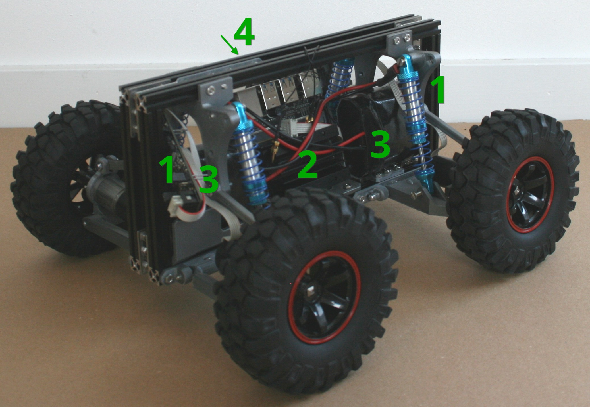

# Hardware

Box's hardware is designed around a jetson nano and motor driver boards by EduArt.  
The EduArt boards are the ethernet to CAN converter Behind the jetson and the two motor drivers above the batteries

## Side view

1. Motor Controller boards
   > Take commands from CAN to control motors
2. Jetson nano
   > Main Computer  
   > Gets hot under load
3. Batteries
   > 6s (25.2V) battery pack
4. Ethernet to CAN converter
   > Provides CAN interface to the jetson

## Power board

Unfortunately it's not in this picture, but on top of the jetson nano's heatsink lies a green board.  
This board routes power to all components, contains a Fuse and connects the power switch.

> The Fuse should be a 4~7A slow-blow

### Charging

The power board has a yellow XT60 connector on the bottom, which is directly connected to the batteries over the fuse.
> Apply max. 25.2V at max. 3A to charge the batteries.

### Enable/Disable

A compact transistor setup on the board comprises the enable circuit.
It is wired to 3v3, GND and pin 7 via the 3-pin connector.

<!-- TODO: add enable circuit docs  -->

| RES     | FPS |
|---------|-----|
| 320x240 | 30  |
