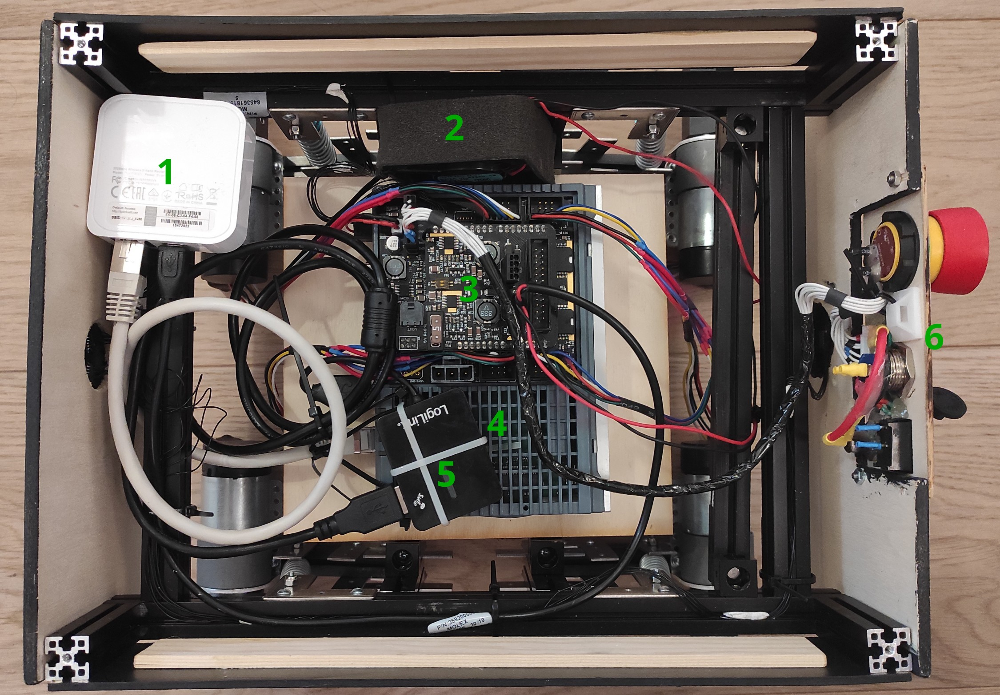
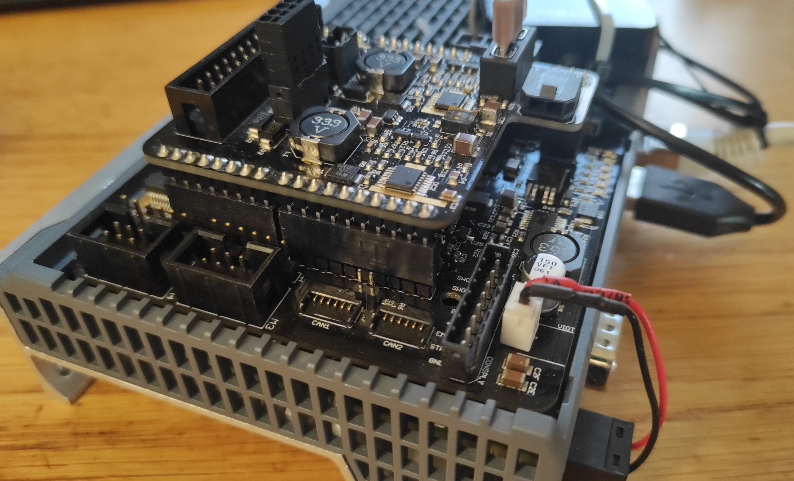

# Hardware

Zyklop's hardware is designed around a Siemens IOT2050.  
The IOT carries a board by EduArt, which contains basically everything important.

## A look from above

1. Wi-Fi Access point
   > SSID: TP-Link_F496  
   > Password: 15472922
2. Fan
   > Cools IOT2050
3. EduArt board
   > I/O board for almost all hardware
4. IOT2050
   > Main computer  
   > Gets really hot even when doing nothing
5. USB hub
   > Generic hub, not currently needed
6. Button panel
   > Only thing that sticks out of the robot  
   > ==**99% of problems are just a pressed emergency stop!**==

## Network

The left Ethernet jack on the IOT has a damaged retainer. Cables just flop out of it.  
Unfortunately this is the gigabit port. The other one supports a mere 100mbit.  
It is now tied down with cable ties in attempt to remedy the issue.

Both ports are independent and thus 2 separate networks can be patched in.
> **left:** Automatic (DHCP), AP sets it to `192.168.1.200`  
> **right:** Automatic (DHCP)

The Wi-Fi module is only capable of 2.4GHz and not particularly strong.  
You will likely experience interference when operating in a noisy environment (e.g. competitions).

> If you want to drive with a tether, connect an ethernet cable to port 2

## EduArt board

This board is in charge of connecting everything together and driving the motors.  

It's documented over at
[github.com/EduArt-Robotik/iotbot](https://github.com/EduArt-Robotik/iotbot#electrical-interface).

The most important thing is the orientation of the motor connectors, which looks like this:  

## Battery

The battery used is a 22.4V NiMH.  
It is recommended to give it long charge times periodically,  
since the battery has no built-in BMS, and NiMHs auto-balance this way.

