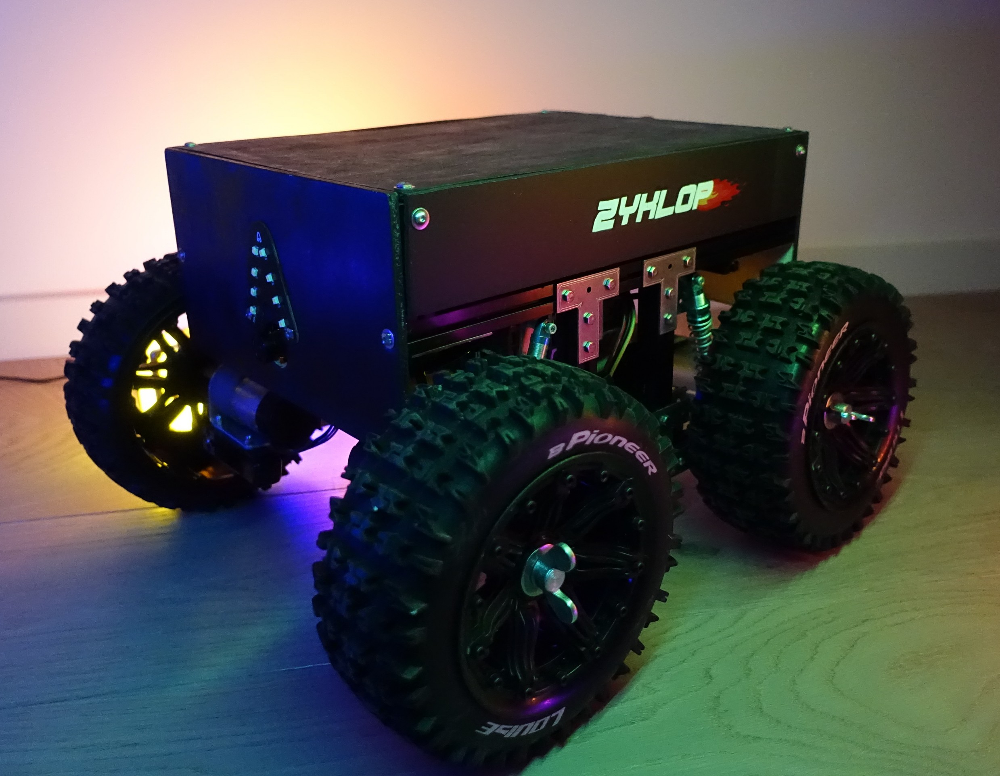

# Welcome

## Zyklop

Zyklop *(german: Cyclops)* is Bento robotics' first robot.  
It has many shortcomings and issues, but hey, it works!

It's made of 15*15mm makerbeam with wood plates hiding its cable mess.  
